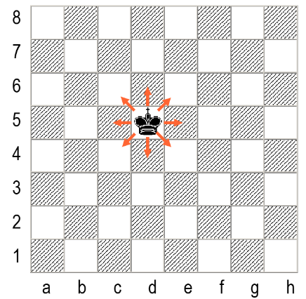
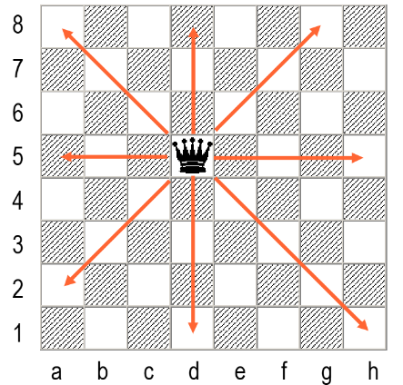
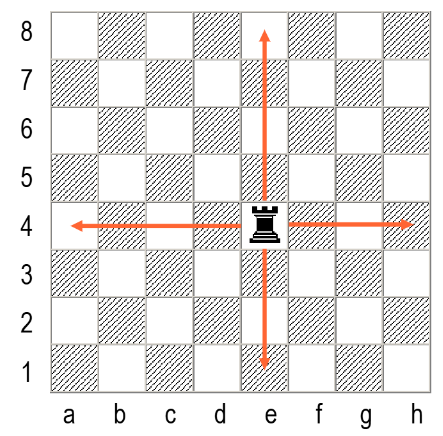
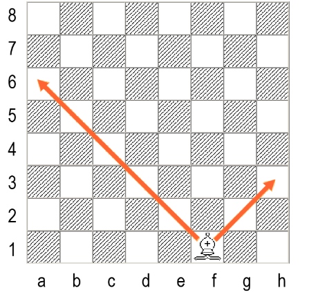
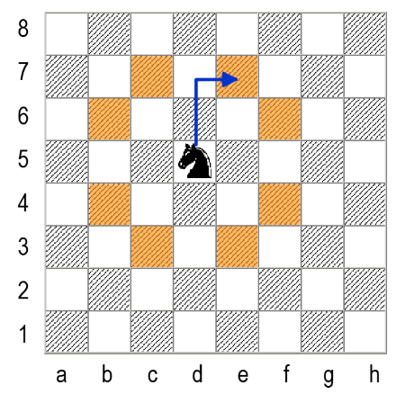
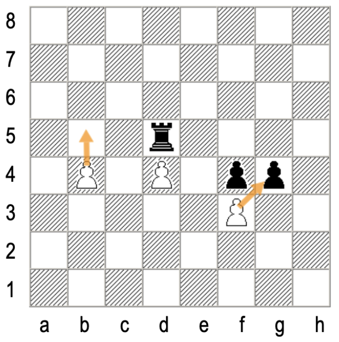
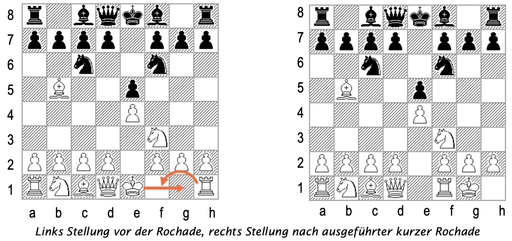
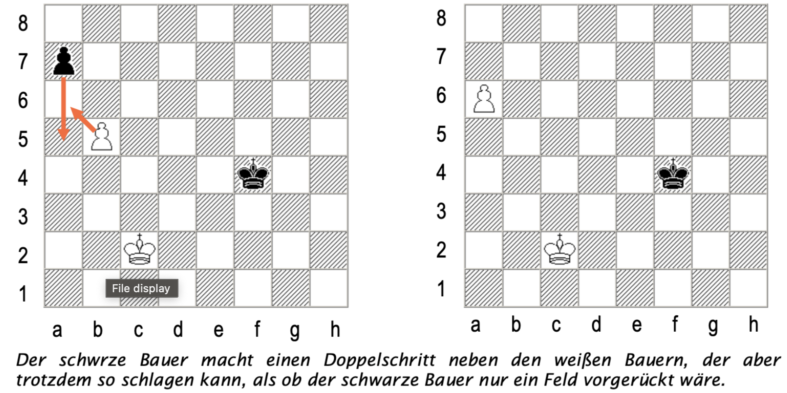
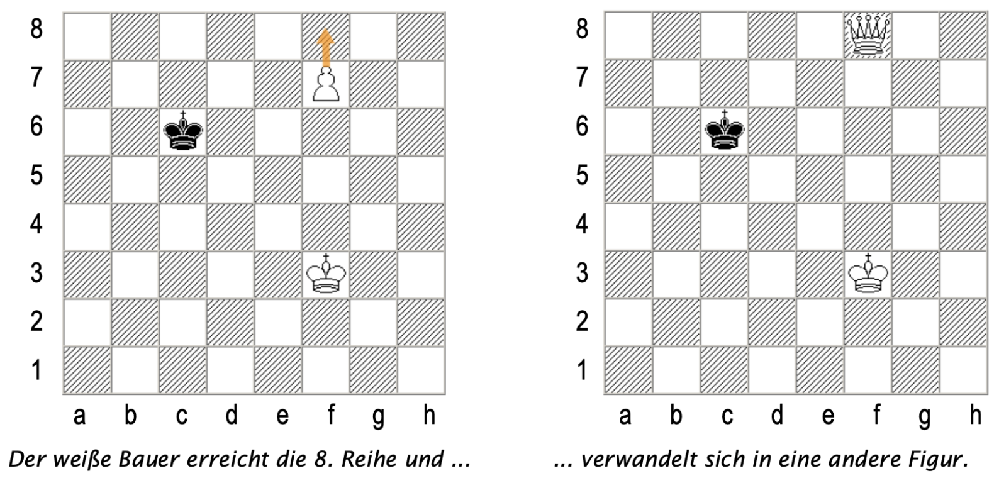
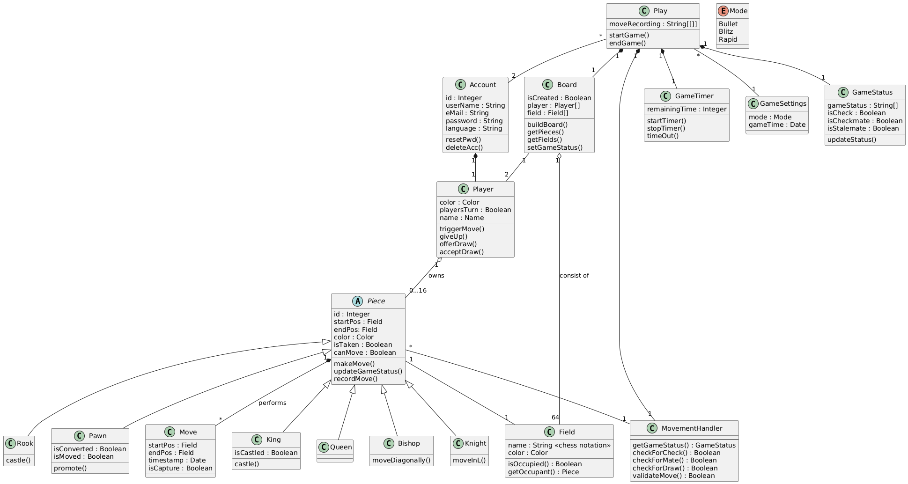

# uni-project-chess
Im Rahmen unserer Software-Engineering Vorlesung entwerfen wir eine **Modellierung** des Spiels Schach. 
Die **Projektanforderungen** sehen wie folgt aus:
- Jeder Spieler eigener/s PC / Tablet / Smartphone, Spiel läuft auf einem Server
- Anwendung stellt graphisch dar und checkt Validität von Benutzeraktionen
- Nicht: Computer als Spieler

Dafür werden folgende **UML-Diagramme** ausgearbeitet:
- Use-Case Diagramm
- Klassendiagramm
- Sequenzdiagramm

## 📖 Schachregeln

Schach ist ein strategisches Brettspiel für zwei Spieler. Hier sind die grundlegenden Regeln:
### Spielbrett und Aufstellung

Das Schachbrett besteht aus 64 Feldern (8x8) in abwechselnd hellen und dunklen Farben.
Jeder Spieler beginnt mit 16 Figuren: 1 König, 1 Dame, 2 Türme, 2 Läufer, 2 Springer und 8 Bauern.
Die Figuren werden in einer spezifischen Anordnung auf den beiden dem Spieler nächstgelegenen Reihen aufgestellt.

### Grundlegende Spielmechanik

Weiß macht den ersten Zug, danach ziehen die Spieler abwechselnd.
Ein Zug besteht aus dem Bewegen einer eigenen Figur auf ein freies Feld oder dem Schlagen einer gegnerischen Figur.
Jede Figurenart hat ihre eigenen Bewegungsregeln.

### `Figuren`

<table>
<tr>
<td>

**♚ König** 
Kann ein Feld in jede Richtung ziehen.

</td>
<td>

</td>
</tr>

<tr>
<td>

**♛ Dame** 
Bewegt sich beliebig viele Felder horizontal, vertikal oder diagonal.

</td>
<td>

</td>
</tr>

<tr>
<td>

**♜ Turm** 
Zieht beliebig viele Felder horizontal oder vertikal. 

</td>
<td>

</td>
</tr>

<tr>
<td>

**♝ Läufer** 
Bewegt sich beliebig viele Felder diagonal.

</td>
<td>

</td>
</tr>

<tr>
<td>

**♞ Springer** 
Zieht in einem "L"-Muster: zwei Felder in eine Richtung und dann ein Feld im 90-Grad-Winkel.

</td>
<td>

</td>
</tr>

<tr>
<td>

**♟ Bauer** 
Zieht ein Feld vorwärts (beim ersten Zug optional zwei Felder).  
Schlägt diagonal ein Feld vorwärts.

</td>
<td>

</td>
</tr>
</table>

### `Spezielle Regeln`

**Schach:** Wenn der König bedroht ist, muss der Spieler diese Bedrohung im nächsten Zug abwenden.  

**Schachmatt:** Das Spiel endet, wenn ein König im Schach steht und keine legale Möglichkeit hat, diesem zu entkommen.  

**Patt:** Das Spiel endet unentschieden, wenn ein Spieler am Zug ist, aber keinen legalen Zug machen kann, ohne seinen König ins Schach zu setzen.  

**Rochade:** Ein spezieller Zug, bei dem König und Turm gleichzeitig bewegt werden.

**En Passant:** Eine spezielle Fangmethode für Bauern.

**Bauernumwandlung:** Ein Bauer, der die gegnerische Grundlinie erreicht, wird in eine andere Figur (üblicherweise eine Dame) umgewandelt.

## 👨🏽‍💻 Unsere Vorgehensweise
<table>
<tr>
<td>

### 🛠️ Tools:

- Github Repository
- Github Projects
- [PlantUML](https://plantuml.com)

</td>
<td>

</td>
</tr>
</table>

## ⛓️‍💥 UML-Diagramme

### `Use-Case Diagramm`

#### Detaillierte Use-Case Beschreibungen:
- [Use Case 1: Figur umwandeln](/Use%20Cases/use-case-figurumwandeln.md)
- [Use Case 2: Zug machen](/Use%20Cases/use-case-zugmachen.md)
- [Use Case 3: Spiel anlegen](/Use%20Cases/use-case-spielanlegen.md)
- [Use Case 4: Aufgeben](/Use%20Cases/use-case-aufgeben.md)
- [Use Case 5: Einstellungen ändern](/Use%20Cases/use-case-einstellungaendern.md)
- [Use Case 6: Zug validieren](/Use%20Cases/use-case-zugvalidieren.md)

### `Klassendiagramm`

Zusätzlich haben wir ein [Data Dictionary](/Classes/dataDictionary.md) und eine [Übersicht der Assoziationen](/Classes/associations.md) zwischen den Klassen erstellt.

### `Sequenzdiagramm`

Wir haben für den Zug eines Bauern (mit all seinen Möglichkeiten: En Passant, Umwandlung) ein UML Sequenzdiagramm erstellt: 

## 💡 Unsere Learnings
- [PlantUML](https://plantuml.com) ein sehr cooles Tool!
- Umgang mit Github (Versionskontrolle, Zusammenarbeit mit dem Team, etc.)
- Best Practices des Software-Engineerings, bzw. der Softwaremodellierung

## ℹ️ Quellen
Garber, Thomas. (2009). *Schach - Die Spielregeln*. [PDF](/Schachregeln.pdf)
